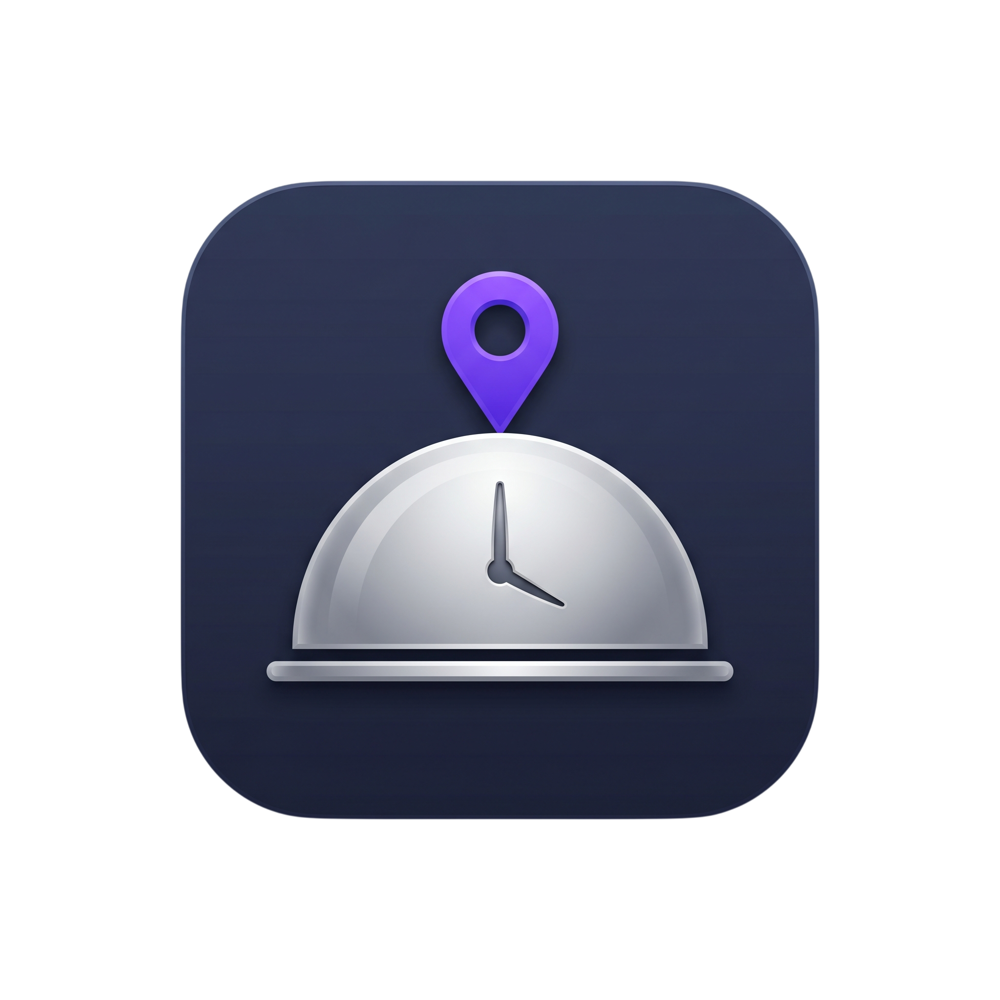

  

# 🍳 Context-Aware Recipe Discovery
## Flutter Recruitment Assignment - ICSPL

A production-grade Flutter application that provides an intelligent, offline-capable recipe discovery experience. It leverages real-time context (Location & Time) to suggest the perfect meal.

---

## 🏗️ Detailed Architecture

The application is built using **Feature-Driven Clean Architecture**, ensuring strict separation of concerns, high testability, and modularity.

### 1. The Data Layer (Persistence & Networking)
- **Repository Pattern**: All data flow is mediated by repositories that handle the logic between remote (TheMealDB API) and local (Drift/SQLite) sources.
- **Offline-First Strategy**: The app proactively caches searched recipes and ensures all "Favorite" data is stored locally for 100% offline accessibility.
- **Service Isolation**: Specialized services handle cross-cutting concerns:
    - `ApiService`: Standardized Dio-based network layer.
    - `LocalStorageService`: DAO-style access to the SQLite database.
    - `LocationService`: Passive geolocation wrapper.
    - `NotificationService`: Local scheduling engine.

### 2. The Domain Layer (Business Logic)
- **Entities**: Plain Dart objects (models) representing the core data structures (Meal, Ingredient), independent of any framework.
- **Interfaces**: Definition of repository contracts to allow easy mocking and decoupled implementation.

### 3. The Presentation Layer (UI & State)
- **Riverpod (2.x)**: Managed via Code Generation for compile-time safety.
- **AsyncValue**: Used to handle loading, error, and data states reactively and consistently.
- **Optimistic UI**: Favorites are updated instantly in the UI while the database operation runs in the background, providing a lag-free feel.

---

## 🧠 The Recommendation Engine

Moving beyond static keywords, the app features a hybrid **Recommendation Engine**:
1.  **Personalization (Warm Start)**: Analyzes your "Favorites" to build a category frequency map. It prioritizes recipes from your most-liked category.
2.  **Dynamic Discovery (Cold Start)**: If no favorites exist, it uses a rotating pool of seed categories that updates every minute.
3.  **Serendipity Injection**: Every recommendation set includes a completely random meal (Discovery) to prevent a "filter bubble."
4.  **Shuffle Logic**: Results are shuffled on every load to ensure the dashboard always feels fresh and alive.

---

## 🚀 Challenges Faced & Solutions

| Challenge | Impact | Resolution |
| :--- | :--- | :--- |
| **Isolate Crashes** | "Illegal argument in isolate message" errors during background mapping. | Refactored mapping logic to **static/top-level functions** to prevent implicit capture of the non-serializable database instance. |
| **CI/CD Triggers** | Pipeline wasn't triggering on push to `master`. | Identified branch name mismatch (`main` vs `master`) and aligned the YAML configuration and documentation. |
| **Android 12+ Alarms** | App crashed when scheduling meal reminders. | Implemented `USE_EXACT_ALARM` permissions and dynamic permission checks for Android 12, 13, and 14+. |
| **Sliver Overflows** | "Vertical viewport given unbounded height" error in the new UI. | Refactored Shimmer loaders from `ListView` to `Column` to ensure compatibility with `SliverToBoxAdapter`. |
| **Perceived Lag** | UI felt slightly sluggish on high-end devices. | Integrated `flutter_displaymode` to force **120Hz refresh rate** on supported Android devices. |

---

## ✨ Features & Polish

- **120Hz Support**: Buttery-smooth scrolling optimized for modern displays.
- **Portrait Lock**: Orientation explicitly locked to Portrait to ensure UI integrity and consistent UX.
- **Premium UI**: Large scrolling `SliverAppBar`, staggered entrance animations, and Hero transitions.
- **Ethical UX**: Informative dialogs that explain the *why* before asking for system permissions.
- **Total Offline Resilience**: Fully functional cookbook, including cached images and SQL data.
- **Meal Reminders**: Scheduled notifications for Breakfast, Lunch, and Dinner.

---

## 🛠️ Tech Stack

- **Framework**: Flutter 3.x
- **State**: Riverpod (Generators)
- **Database**: Drift (SQLite)
- **Network**: Dio
- **Animations**: Staggered Animations & Hero
- **Storage**: Shared Preferences (UX Persistence)
- **DevOps**: GitHub Actions (CI/CD)

---

## 📖 Setup Guide

1. **Install Dependencies**: `flutter pub get`
2. **Generate Code**: `dart run build_runner build --delete-conflicting-outputs`
3. **Generate Assets**: `dart run flutter_launcher_icons`
4. **Run**: `flutter run`
